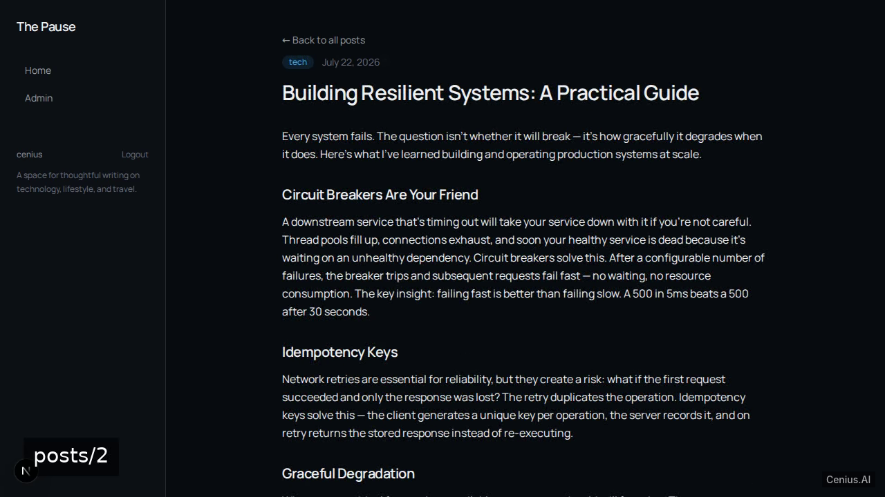
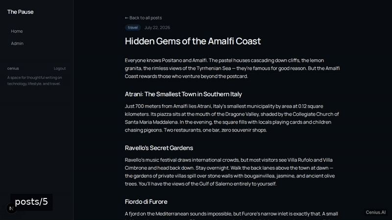
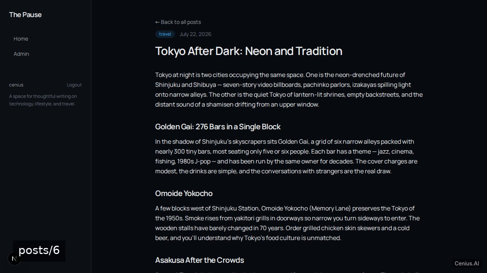
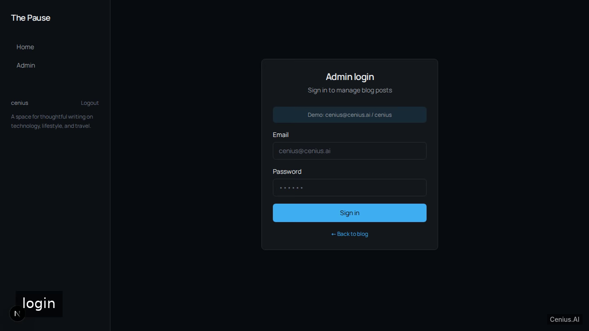

# Markdown Blog & Admin — production-ready V blog platform starter

Need a self-hosted blog platform? **Markdown Blog & Admin** is the open-source answer: a V project you can clone, run, and own. A polished, multi-page blog web application built with Next.js 15 and TypeScript (App Router). Every Markdown Blog & Admin line of code is here — no stripped demo, no paywalled features. Apache-2.0-licensed; [remix Markdown Blog & Admin on cenius.ai](https://cenius.ai/marketplace/p/markdown-blog-admin?ref=gh&utm_campaign=markdown-blog-admin-vlang) for a bespoke custom version.


[](LICENSE)  [](https://cenius.ai)

[](https://cenius.ai/marketplace/p/markdown-blog-admin?ref=gh&utm_campaign=markdown-blog-admin-vlang)

> **▶ [Open & edit in cenius.ai](https://cenius.ai/marketplace/p/markdown-blog-admin?ref=gh&utm_campaign=markdown-blog-admin-vlang)** — one click to an editable workspace: describe changes in plain English, get an instant preview, one-click deploy and host. Modifications made on the platform come with full rebrand & relicense rights.

_Local clone? See [Quick start](#quick-start) below. cenius.ai is the zero-setup path._

## Demo





▶ **[See it in action](https://cenius.ai/marketplace/p/markdown-blog-admin?ref=gh&utm_campaign=markdown-blog-admin-vlang)** — full demo on the project page · [MP4](.github/media/demo.mp4)

## Screenshots

  

## Features

- Public Post Listing
- Post Detail View
- Admin Post CRUD
- Responsive Clean UI

## Quick start

```bash
./install.sh   # installs dependencies + seeds demo data
```

See [`INSTALL.md`](INSTALL.md) for full setup and usage instructions.

## Architecture

No external services required: the entire blog platform runs from this V repo (44 files). Top-level layout: `app/`, `components/`, `lib/`, `prisma/`. `install.sh` wires up dependencies and loads seed records; after it runs the app has real data to show. Full setup details: [`INSTALL.md`](INSTALL.md).

## Usage guide

### Overview

This is **blog-admin** — an HTTP API + web UI. This document covers the surface area you can use, with copy-pasteable examples for each entry point. For setup, see `INSTALL.md`.

### Quickstart

After completing the install steps in `INSTALL.md`:

```bash
npm run dev    # start the server
## in another terminal:
curl http://localhost:8000/
```

### Endpoints

Every endpoint below was extracted from the source by the route scanner (Next.js / FastAPI / Flask / Django / Express).

| Method | Path | Source file |
|--------|------|-------------|
| `GET` | `/` | `app/page.tsx` |
| `GET` | `/admin/posts` | `app/admin/posts/page.tsx` |
| `GET` | `/admin/posts/:id/edit` | `app/admin/posts/[id]/edit/page.tsx` |
| `GET` | `/admin/posts/new` | `app/admin/posts/new/page.tsx` |
| `GET` | `/login` | `app/login/page.tsx` |
| `GET` | `/posts/:id` | `app/posts/[id]/page.tsx` |

#### curl examples

##### `GET /`

```bash
curl http://localhost:8000/
```

##### `GET /admin/posts`

```bash
curl http://localhost:8000/admin/posts
```

##### `GET /admin/posts/:id/edit`

```bash
curl http://localhost:8000/admin/posts/1/edit
```

##### `GET /admin/posts/new`

```bash
curl http://localhost:8000/admin/posts/new
```

##### `GET /login`

```bash
curl http://localhost:8000/login
```

### Worked example

1. Boot the server (`npm run dev`).
2. Hit a smoke-test endpoint:

```bash
curl -sS http://localhost:8000/
```

3. If you get a JSON / HTML response, the server is healthy. Inspect `.env` if it errors with an auth/config failure.

### Reference

#### Entry points

_Full guide: [`USAGE.md`](USAGE.md)_

## FAQ

### How do I get Markdown Blog & Admin running locally?

`git clone` + `./install.sh` gets you a running instance — the install script provisions dependencies and demo data. Full steps live in [`INSTALL.md`](INSTALL.md); nothing external is needed to try it.

### How is Markdown Blog & Admin built technically?

The app is built with V. What you see in this repo is the full production source, demo data included. Highlights include responsive Clean UI.

### What license does Markdown Blog & Admin use?

Yes — Apache-2.0-licensed, so commercial use, modification, and distribution are all permitted. Read the full terms in [LICENSE](LICENSE).

### Is it possible to white-label Markdown Blog & Admin for a client?

Rebranding is straightforward under the MIT license — change what you want in the source. Or [open it on cenius.ai](https://cenius.ai/marketplace/p/markdown-blog-admin?ref=gh&utm_campaign=markdown-blog-admin-vlang): the platform handles the changes and grants full rebrand rights on the result.

### Can I change Markdown Blog & Admin without writing code?

Open it on [cenius.ai](https://cenius.ai/marketplace/p/markdown-blog-admin?ref=gh&utm_campaign=markdown-blog-admin-vlang) and describe the changes you want in plain English — the platform modifies the app and gives you a new, downloadable build.

## License & rebranding

Released under the [Apache License 2.0](LICENSE) (© 2026 Cenius AI) — free for personal and commercial use. The Cenius name/logo are trademarks (see NOTICE).

**Need a customized version?** [Remix this app on cenius.ai](https://cenius.ai/marketplace/p/markdown-blog-admin?ref=gh&utm_campaign=markdown-blog-admin-vlang) — modifications made on the platform come with **full rebrand & relicense rights** over your derivative.

## Built with cenius.ai

This entire application — code, design, seeded demo data — was generated on **[cenius.ai](https://cenius.ai)** from a plain-English description.

- 🚀 [Build your own app on cenius.ai](https://cenius.ai)
- 🎛️ [Remix Markdown Blog & Admin on the marketplace](https://cenius.ai/marketplace/p/markdown-blog-admin?ref=gh&utm_campaign=markdown-blog-admin-vlang) — open it in a workspace, prompt for changes, and ship your own version.

More open-source apps: [the Cenius-ai catalog](https://github.com/Cenius-ai) · [showcase index](https://github.com/Cenius-ai/showcase)
